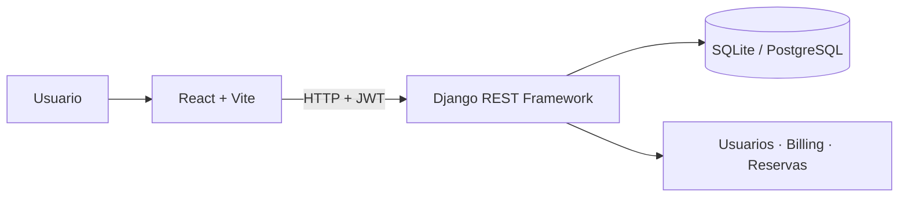

<div align="center">

# SGC · Sistema Web de Gestión de Condominios

Plataforma full stack para centralizar la administración financiera, operativa y comunitaria de condominios.

[](https://github.com/gschwember/Portafolio-titulo/actions/workflows/ci.yml)


</div>

## Descripción

SGC nace como proyecto de título de Analista Programador en Duoc UC. Resuelve en una sola aplicación tareas que normalmente se administran de forma fragmentada: gastos comunes, pagos, reservas de espacios, lectura de medidores y gestión de usuarios.

El sistema ofrece experiencias y permisos diferenciados para cuatro perfiles: **superadministrador**, **administrador**, **conserje** y **residente**.

## Funcionalidades principales

- Autenticación con access token en memoria, refresh token `HttpOnly` y protección por rol y condominio.
- Administración de condominios, unidades y asignaciones de residentes.
- Generación y cierre de periodos de gastos comunes.
- Registro, validación e historial de pagos y comprobantes.
- Reserva y aprobación de espacios comunes.
- Ingreso de lecturas de medidores por conserjería.
- Paneles específicos para cada perfil de usuario.
- API REST versionada y suite automatizada de pruebas.

## Arquitectura



El frontend sigue una organización por capas inspirada en Feature-Sliced Design (`app`, `pages`, `widgets`, `features`, `entities` y `shared`). El backend separa configuración por entorno y organiza el dominio en aplicaciones Django independientes.

## Tecnologías

| Área | Tecnologías |
| --- | --- |
| Frontend | React 19, Vite 8, React Router 7, Tailwind CSS 3 |
| Backend | Python, Django 6, Django REST Framework |
| Seguridad | JWT con cookie `HttpOnly`, límite de intentos, membresías por condominio, CORS y CSRF |
| Datos | SQLite para desarrollo, PostgreSQL para producción |
| Calidad | ESLint, Pytest, Pytest-Django y GitHub Actions |

## Ejecución local

### Requisitos

- Node.js 22 o superior
- Python 3.12 o superior
- Git

### 1. Clonar el proyecto

```bash
git clone https://github.com/gschwember/Portafolio-titulo.git
cd Portafolio-titulo
```

### 2. Preparar el backend

```bash
cd sgc-backend
python -m venv .venv
source .venv/bin/activate
pip install -r requirements/dev.txt
cp .env.example .env
python manage.py migrate
python manage.py seed_test_data
python manage.py runserver
```

En Windows PowerShell, activa el entorno con `.\.venv\Scripts\Activate.ps1` y copia las variables con `Copy-Item .env.example .env`.

### 3. Preparar el frontend

En otra terminal:

```bash
cd sgc-frontend
cp .env.example .env
npm ci
npm run dev
```

Abre [http://localhost:5173](http://localhost:5173). La API estará disponible en [http://localhost:8000/api/v1/health](http://localhost:8000/api/v1/health).

## Usuarios de demostración

Después de ejecutar el comando de datos de prueba, todas las cuentas utilizan la contraseña `SgcSecure2026!`.

| Perfil | Correo |
| --- | --- |
| Superadministrador | `superadmin@sgc.cl` |
| Administrador | `admin@sgc.cl` |
| Conserje | `conserje@sgc.cl` |
| Residente | `residente1@sgc.cl` |

> Estas credenciales son exclusivamente para desarrollo local. Nunca deben utilizarse en producción.

## Verificación de calidad

```bash
# Frontend
cd sgc-frontend
npm run lint
npm run build

# Backend
cd ../sgc-backend
python manage.py check
python -m pytest
```

Cada `push` y `pull request` ejecuta estas verificaciones automáticamente mediante GitHub Actions.

## Documentación técnica

- [Arquitectura del frontend](sgc-frontend/src/ARCHITECTURE.md)
- [Modelo entidad-relación](sgc-backend/docs/MER.md)
- [Datos de demostración](sgc-backend/README_SEEDS.md)
- [Documentación del backend](sgc-backend/README.md)
- [Documentación del frontend](sgc-frontend/README.md)

## Estado del proyecto

El flujo principal está implementado y el backend cuenta con **29 pruebas automatizadas**. Los datos operativos se filtran según las membresías activas de cada usuario. Como evolución futura se considera ampliar la cobertura del frontend, incorporar recuperación de contraseña y añadir observabilidad para producción.

## Autor

Proyecto académico mantenido por [gschwember](https://github.com/gschwember).
